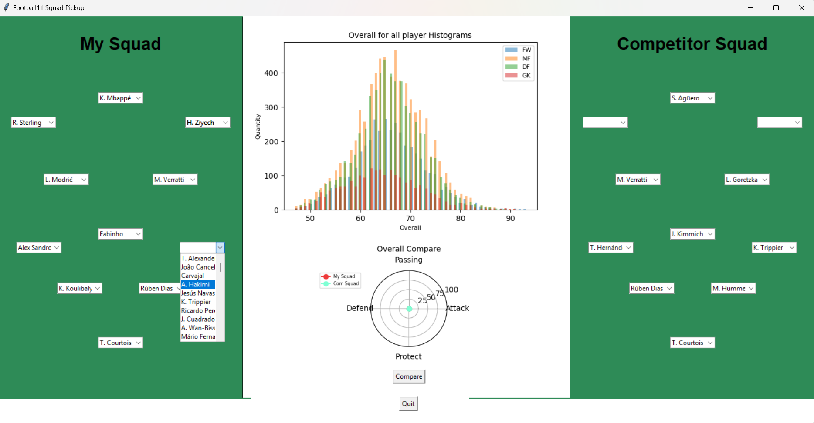
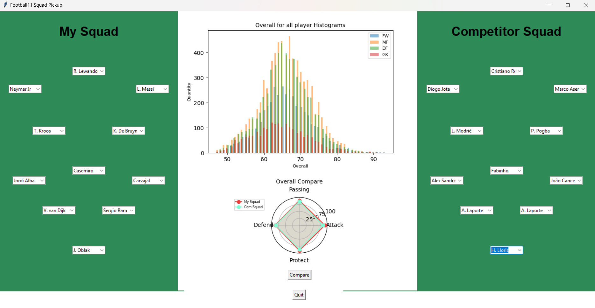
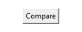
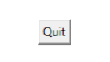
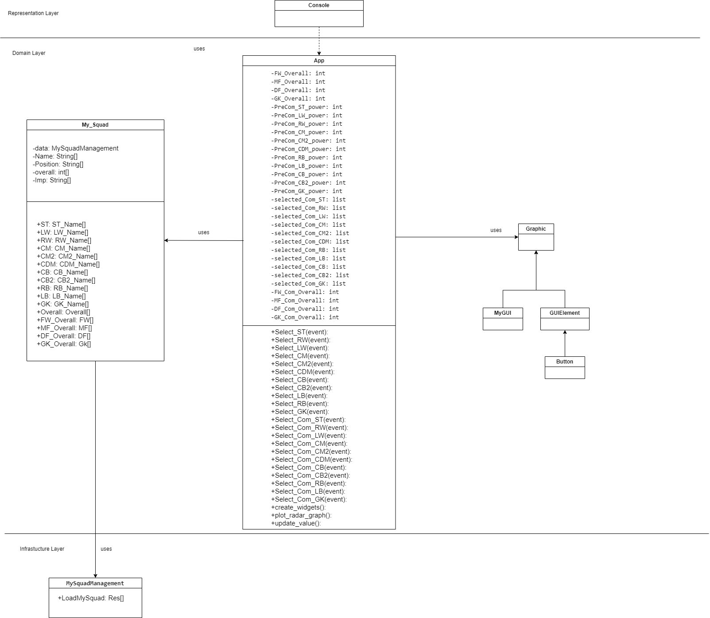

# FOOTBALL11 SQUAD PICKUP

#### Decription
For this project, I make a football squad pickup program. In this program, you can select your own football player for each position in your squad and also can select the football player for the competitor squad. Each player, they have an overall stat. After you select your football player, you can click compare button that places in the middle of the screen then the program will calculate the overall for 4 topics namely Attack, Passing, Defend and Protect then it will show the compare result in the radar graph.

* Attack => ST, CF, RW, LW
* Passing => CM, CAM, CDM, LM, RM
* Defend => CB, RB, LB
* Protect => GK

In addition, in the middle top of UI, I represent the overall stat from the example group of football players in terms of a histogram graph. 

# Instrution

#### Step
1. Click on each combo box to select your football player.

2. Click on Compare button to compare the overall stat. The result will show in a radar graph.

3. You can change football players as mush as you want. But every time that you change, you need to click on compare button to show the result.

4. If you want to quit the program, click on the Quit button at the bottom of the program.

# Code
* `main.py` : In this file, I use to do mainloop and run program.
* `MySquadManagement.py` : In this file, I use to load the data from `player_22.csv` file. It return list of data.
* `My_Squad.py` : In this file, I use to separate the data from the `MySquadManagement` list and return list of each data.
* `Graphic` : In this file, I use to make all GUI graphic and calculate the overall stat then create the graph
* `player_22.csv` : The data sort. [link](https://www.kaggle.com/datasets/stefanoleone992/fifa-22-complete-player-dataset) 

# Diagram
